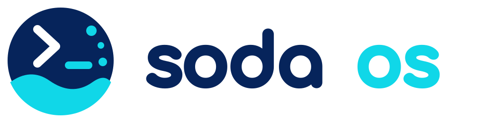

# Soda OS



Soda OS is an opinionated Fedora bootc remote-development appliance for a
trusted team. A powerful x86-64 or AArch64 machine runs the development work;
laptops, editors, terminals, and browsers remain lightweight clients.

WSL2 support for x86-64 Windows gaming PCs is planned for a future release.
No Soda OS WSL2 distribution is currently available.

## Product contract

Human installation uses one finished network ISO. Stock graphical Anaconda
handles storage, networking, bootloader, firmware, and bootc deployment. After
the installed system starts, **Soda Setup** creates the first administrator,
installs the SSH public key, prepares Forgejo, and either connects Tailscale or
trusts the current connection through **Allow access from the local network**.
The same Soda Setup state and operations serve reusable QCOW2 systems through
their console and Cockpit. The ISO is the only installation medium the owner
prepares.

On a trusted LAN, OpenSSH, Cockpit, Forgejo, and project development servers are
directly reachable over the LAN. In cloud environments, OpenSSH, Cockpit, and
Forgejo use Tailscale and are never exposed to the public Internet.

Each person has one primary Linux account. Linux `wheel` membership is the only
administrator fact, and stock Cockpit Accounts owns user listing and promotion.
Development happens in a separate derived Linux workspace account for every
selected person-project pair. Each workspace has its own UID, private home,
complete Git clone, dependencies, processes, and mutable state.

Soda Setup creates the first same-named Linux and Forgejo administrator and
installs that administrator's public SSH key in Linux and registers it with
Forgejo. Later primary accounts are created through stock Cockpit or Linux; a
person's first normal Forgejo sign-in creates their matching profile through
PAM, and they manage Forgejo keys there. Git uses SSH.

Workspace creation copies the person's current public SSH keys once into the
workspace's standard `authorized_keys` and creates a workspace-private outbound
Git key. When repository authentication is unavailable, Projects reports that
public key for the person to register through the authoritative Git host before
retrying. Projects accepts no Forgejo password and registers no workspace key.
It reports that the workspace account exists as soon as the derived Linux
account exists, including while a failed clone remains retryable; account
existence is not a claim that setup completed. It never copies private keys,
Tea configuration, gh configuration, or tokens. Tea and GitHub CLI are
available in every workspace, and each is authenticated manually there.

Stock Cockpit provides host administration and one focused Soda Projects page.
Repositories are created through Forgejo or the external authoritative Git host
and added to the shared project list with their SSH clone URL. Everyone can view
and edit display information and additional metadata in that list and create or
remove their own workspace. The project ID and canonical SSH clone URL are
immutable after addition. Replacing the URL requires an administrator to remove
the project and its local workspaces, then add it again; the authoritative
repository itself remains intact. Only an administrator removes an entire
project. Projects listing and workspace setup do not depend on Tailscale
enrollment. The browser builds SSH guidance from the host used to open Cockpit
instead of asking Projects to choose a LAN or Tailnet identity.

Removing a person deletes their workspaces first, their Forgejo account second,
and their primary Linux account last. A failure stops immediately and reports
what succeeded and remains. Soda adds no rollback, archive, transfer, approval,
or recovery workflow; the trusted team coordinates destructive actions.

`mise` owns development-tool installation, versions, and project toolchain
configuration. People invoke and configure `mise` directly inside their
workspaces; project configuration is shared through the project's native
repository workflow. Upstream tool managers own their caches. Projects exposes
no tool selector, install action, shared tool storage, status, retry, or cleanup
lifecycle. Soda owns no toolchain package manager, downloader, cache service,
profile system, or version database. Coding assistants are selected and
authenticated separately per workspace.

Administrators update explicitly through native bootc operations. Automatic
updates are disabled. Supported fallback selects an earlier exact signed image
while preserving current accounts and data. Soda has no updater, recovery
engine, runtime daemon, general API, workflow engine, credential broker, or
reconciliation service.

The [base principles](docs/principles.md) explain the product purpose. The
[architectural reset](docs/architecture-reset.md) defines the accepted
architecture. See the public handbook for [installation](docs/public/20-Deploy/20-install-on-premises.md),
[people and access](docs/public/30-Develop/10-people-and-access.md),
[projects and workspaces](docs/public/30-Develop/20-projects-and-workspaces.md),
and [administration](docs/public/40-Operate-Soda-OS/10-administration.md).

## Repository layout

- `cmd`: bounded product and artifact commands
- `cockpit`: the stock-Cockpit Projects package
- `internal`: Projects, host integration, and artifact construction
- `distro`: Soda identity, locks, and base inputs
- `packaging`: bootc, installer, and RPM inputs
- `assets`: canonical branding sources and rendered assets
- `docs`: architecture, public handbook, installer, and release documentation
- `tests/acceptance`: matching-native installed-product evidence
- `scripts` and `tools`: repository verification and developer tooling

## Development

Run source checks and build only on matching-native hardware:

```sh
just check
ARCH=x86_64 # or aarch64 on matching-native hardware
just rpm "$ARCH"
just oci "$ARCH"
```

Build artifacts are written below `.artifacts/` and are never committed.
Architecture-specific inputs, construction, inspection, installation, signing,
and publication remain owned by the matching architecture.

Engineering details are recorded in
[the implementation architecture](docs/architecture.md),
[the installer contract](docs/installer.md),
[acceptance documentation](tests/acceptance/README.md), and
[release operations](docs/release-operations.md).
